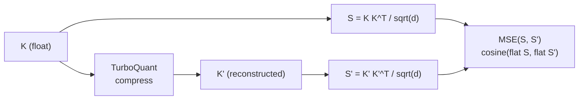

# ⚡ TurboQuant — Extreme KV Cache Quantization

[](https://pypi.org/project/turboquant-kv/)
[](https://pypi.org/project/turboquant-kv/)
[](https://github.com/hackimov/turboquant-kv/actions/workflows/triton-gpu.yml)
[](./LICENSE)

<div align="center">

**Open-source TurboQuant** · PolarQuant + QJL · Decoder LLM KV compression

[Google Research — ICLR 2026](https://research.google/blog/turboquant-redefining-ai-efficiency-with-extreme-compression/) · [arXiv:2504.19874](https://arxiv.org/abs/2504.19874)

</div>

---

Open-source implementation of **TurboQuant** (Google Research, [ICLR 2026](https://research.google/blog/turboquant-redefining-ai-efficiency-with-extreme-compression/)): **KV-cache** compression in decoder LLMs via **PolarQuant** and **QJL** (Quantized Johnson–Lindenstrauss). Theory and motivation are in the [blog post](https://research.google/blog/turboquant-redefining-ai-efficiency-with-extreme-compression/) and on [arXiv:2504.19874](https://arxiv.org/abs/2504.19874).

---

## 📊 Reported results

The [Google Research blog](https://research.google/blog/turboquant-redefining-ai-efficiency-with-extreme-compression/) reports TurboQuant numbers on open LLMs (including Gemma, Mistral, Llama-3.1-8B-Instruct):

| Aspect | Summary |
|--------|---------|
| **KV memory** | Cache size reduced by roughly **6× or more** (including **3 bits** per key/value without fine-tuning). |
| **Attention speed** | Up to about **8×** faster **attention logits** vs. their described **32-bit JAX** baseline on **H100** (for **4-bit** TurboQuant in their setup). |
| **Downstream quality** | On long context and needle-in-a-haystack they report **strong / near-full** results at this compression; comparisons to **KIVI** and others use **LongBench** and related benchmarks (LongBench, ZeroSCROLLS, RULER, L-Eval, etc.). |
| **Vector search** | For high-dimensional search (e.g. **GloVe, d=200**) — competitive **1@k recall** vs. **PQ**, **RabbiQ** in a data-oblivious setting. |

> These figures refer to the **original paper** and its experimental setup; in your environment actual memory savings, latency, and quality depend on the model, bit width, context length, and whether you use **fused Triton** or dequant into standard attention.

---

## 🧰 Library features

### Core (PyTorch)

- **`TurboQuantProd`**: PolarQuant + QJL, **1.5 / 2 / 2.5 / 3 / 4** bits, configurable **`head_dim`**.
- Compress / restore K/V pairs: **`compress` / `decompress`**, **`quantize_kv`** (including returning the compressed representation).
- Optional **calibration** from batches/tensors: **`calibrate_turboquant_from_tensor`**, **`calibrate_turboquant_from_batches`**, **`CalibrationMode`** (see `turboquant.calibration`).

### GPU: Triton (extra `[triton]`, CUDA)

- **Scores from compressed K:** **`quantized_attention_scores_triton`** — `q @ k^T / sqrt(d)` without fully materializing unpacked K; causal mask, additive mask, **GQA/MQA** (`num_kv_heads`).
- **Fused attention (softmax × V)** on compressed K/V: **`quantized_attention_fused_triton`**; supported **`head_dim`**: 16, 32, 64, 128, 256.
- **Paged KV** in the vLLM style: **`quantized_attention_fused_triton_paged`**, packing **`pack_dense_kv_to_paged`**; zeroing allocator copies — **`turboquant.vllm_pack`** (`paged_kv_views_from_allocator_buffer`, `uint8_pages_to_paged_dict`).
- Centroid preload: **`TurboQuantProd.preload_centroids(...)`** (useful on first run for `bits >= 4`).

### Hugging Face Transformers (extra `[hf]`)

- **`TurboQuantModel`**: model wrapper + quantizer; **legacy** path via per-layer tuples **`quantize_past_key_values` / `dequantize_past_key_values`**.
- **`TurboQuantDynamicCache`**: compressed KV on full-width layers; **sliding-window** layers stay ordinary HF layers.
- **`turboquant_encoder_decoder_cache`** / **`TurboQuantEncoderDecoderCache`** (or `TurboQuantModel.make_encoder_decoder_cache()`): HF `EncoderDecoderCache` for **cross-attention KV** (encoder memory). **T5 / mT5:** `head_dim = config.d_kv`. **M2M-100 / NLLB (dense):** Hub configs often use `model_type: m2m_100` and `M2M100ForConditionalGeneration`; `head_dim = config.d_model // config.decoder_attention_heads` (typically **64** for 600M/1.3B/418M, **128** for `nllb-200-3.3B` with `d_model=2048`). Default path keeps **stock HF attention** on decompressed KV for T5 (unscaled logits); **MarianMT** uses the same cross-KV cache idea but is **not** covered by decoder fused attention (`supported_fused_attention_architectures`) until a dedicated wrapper exists.
- Export to per-layer paged tensors: **`turboquant.hf_cache.export_cache_to_paged_per_layer`**.
- **Decoder fused attention (CUDA + Triton)** without full dequant every step for several architectures: **`enable_decoder_fused_attention`** / **`install_decoder_fused_attention`** and related APIs in **`turboquant.hf_fused_attention`**; includes **Llama** (incl. Llama 3.3), **Mistral**, **Qwen2**, **Qwen3**, **Gemma2** (falls back to stock on softcap / non-standard query scaling), **Phi-3** / **Phi-4** / **Phi-4-mini** (HF alias **`phi4`**, same `Phi3Attention`), **Phi-4 Multimodal** text decoder (**`phi4_multimodal`**, `Phi4MultimodalAttention`; vision/audio towers unchanged), **InternLM2 / InternLM2.5** (**`internlm2`**, fused `wqkv`) and **InternLM3** (**`internlm3`**) via Hub `trust_remote_code` (see **`turboquant.hf_internlm_fused`**), **Cohere**, **Granite**, **Starcoder2** — full list: **`supported_fused_attention_architectures()`**.
- Cache modes: e.g. **`triton_fused_layers`**, **`strict_reencode`**, optional **`hybrid_float_cache`** (memory vs. dequant trade-off on long context — see code and `examples/hf_generate_turboquant_cache.py`).

### Out-of-tree integrations

- **vLLM v1:** patch, `--kv-cache-dtype turboquant`, `--turboquant-bits` — [`integrations/vllm_upstream/README.md`](integrations/vllm_upstream/README.md).
- **llama.cpp:** same paged layout as vLLM, **`*.tqmeta`** sidecar, **`turboquant.llama_cpp_pack`** — [`integrations/llama_cpp/README.md`](integrations/llama_cpp/README.md).

### Examples and proxy benchmarks

- `examples/simple_usage.py` — **inner product** / cosine metrics on the score matrix (not only vector MSE).
- `examples/hf_generate_turboquant_cache.py` — generation with compressed cache; **`--fused`** for CUDA+Triton.
- `tests/test_hf_nllb_distilled_600m_hub_config.py` — optional **Hub** fetch of `facebook/nllb-200-distilled-600M` **config only** (no weights): asserts `model_type == m2m_100`, `head_dim = 64`, and `turboquant_encoder_decoder_cache` layer count (skips if offline / no cache).
- `benchmarks/needle_in_a_haystack_simple.py`, `benchmarks/longbench_simple.py` — simplified runs.

---

## ⚠️ Important notes

1. **High MSE between original and reconstructed K/V is expected.** The method optimizes **dot products** (attention logits), not exact L2 reconstruction; judge quality by **score distortion** (see `examples/simple_usage.py`).
2. **Without the fused path**, standard HF attention after a cache update may need to **dequant the entire prefix** to float K/V — cost **grows with context length**. To lower per-step cost, use **CUDA + Triton** and fused (`examples/hf_generate_turboquant_cache.py --fused`, `turboquant/hf_fused_attention.py`).
3. For **Gemma2**, set head size from **`config.head_dim`**, not only `hidden_size // num_attention_heads`.
4. Not every setup is covered by the fused layer (sliding-window / MLA / some masks, etc.) — see **`turboquant/hf_fused_attention.py`** and the integration READMEs.

---

## 📦 Installation

**From PyPI** (distribution name `turboquant-kv`; Python import remains `turboquant`):

```bash
pip install turboquant-kv
pip install "turboquant-kv[triton]"   # GPU: Triton; on Windows pulls triton-windows
pip install "turboquant-kv[hf]"       # transformers — dynamic cache and HF examples
```

**From source:**

```bash
git clone https://github.com/hackimov/turboquant-kv.git
cd turboquant-kv
python -m venv .venv
# Windows: .venv\Scripts\activate
# Linux/macOS: source .venv/bin/activate
pip install -e .
pip install -e ".[triton]"   # GPU: Triton; on Windows pulls triton-windows
pip install -e ".[hf]"      # transformers — dynamic cache and HF examples
```

---

## 🚀 Quick start

From the **repository root**, with venv activated and `pip install -e .` done (plus extras below as needed).

This repo’s maintainers often use a local virtualenv named **`venv_turboquant/`** (listed in `.gitignore`). On Windows, after `.\venv_turboquant\Scripts\activate`, run the same commands as below; or call the interpreter directly, e.g. `venv_turboquant\Scripts\python.exe examples\simple_usage.py`.

**Core without HF** — compress/decompress demo and **inner product** metrics (MSE/cosine on the score matrix):

```bash
python examples/simple_usage.py
# reproducible on CPU: python examples/simple_usage.py --seed 42 --device cpu
```

How those metrics are built (same tensors as in the script):



Example (**CPU**, `python examples/simple_usage.py --seed 42 --device cpu`) — stable for that seed/device pair; CUDA or another seed will differ:

```text
Device: cpu

Compressing KV...
Decompressing KV...
MSE inner product : 0.580963
Cosine similarity : 0.868170

--- attention score matrix (K K^T / sqrt(d)) ---
Cosine similarity (higher better) [#######################---] 0.868170
MSE inner product (lower better, cap=2) [##################--------] 0.580963

[OK] Good quality (cosine > 0.85)
```

**Hugging Face + compressed KV in `generate`** — requires `pip install -e ".[hf]"`:

```bash
python examples/hf_generate_turboquant_cache.py
python examples/hf_generate_turboquant_cache.py --from-config   # no Hub weight download
```

**Fused attention (CUDA + Triton)** — also `pip install -e ".[triton]"`:

```bash
python examples/hf_generate_turboquant_cache.py --fused
python examples/hf_generate_turboquant_cache.py --fused --fused-arch mistral
# if attention type is a subclass of a registered implementation:
python examples/hf_generate_turboquant_cache.py --fused --allow-attention-subclass
```

The script also supports **`--bits`**, **`--strict-reencode`**, **`--hybrid-float-cache`** — see `python examples/hf_generate_turboquant_cache.py -h`.

**Proxy benchmarks** (after `pip install -e .`):

```bash
python benchmarks/needle_in_a_haystack_simple.py
python benchmarks/longbench_simple.py
```

---

## 💻 Core usage

```python
import torch
from turboquant import TurboQuantProd

quantizer = TurboQuantProd(bits=3, head_dim=128)
k = torch.randn(1, 8, 256, 128)
v = torch.randn(1, 8, 256, 128)
compressed = quantizer.compress(k, v)
k_rec, v_rec = quantizer.decompress(compressed)
```

For a full model: **`TurboQuantModel`**, **`make_dynamic_cache()`**, and optionally **`enable_decoder_fused_attention()`** — see `examples/hf_generate_turboquant_cache.py`.

---

## 🔗 Integrations (detailed steps)

| Target | Document |
|--------|----------|
| **vLLM** | [`integrations/vllm_upstream/README.md`](integrations/vllm_upstream/README.md) |
| **llama.cpp** | [`integrations/llama_cpp/README.md`](integrations/llama_cpp/README.md) |

In-code notes: **`VLLM_INTEGRATION_NOTES`**, **`LLAMA_CPP_INTEGRATION_NOTES`** in `turboquant/hf_cache.py`.

---

## 🧪 Tests

```bash
pip install -r requirements.txt
# for test_hf_*: pip install -e ".[hf]"
python -m unittest discover -s tests -p "test_*.py" -v
```

Without `[hf]`, some tests are skipped; without GPU/Triton, CUDA tests are skipped.

---

## 📚 Links

- [TurboQuant — Google Research Blog](https://research.google/blog/turboquant-redefining-ai-efficiency-with-extreme-compression/)
- [arXiv:2504.19874](https://arxiv.org/abs/2504.19874)
